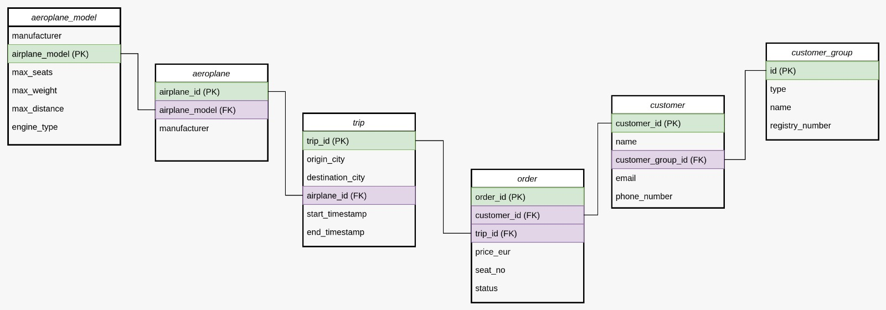
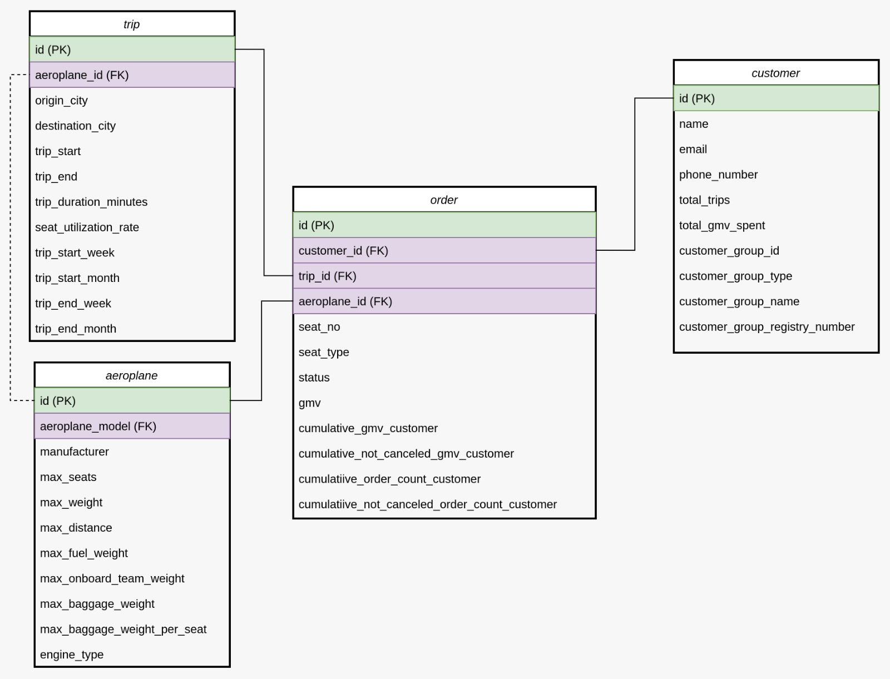
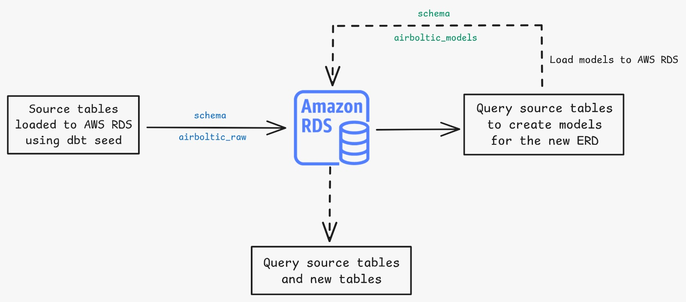
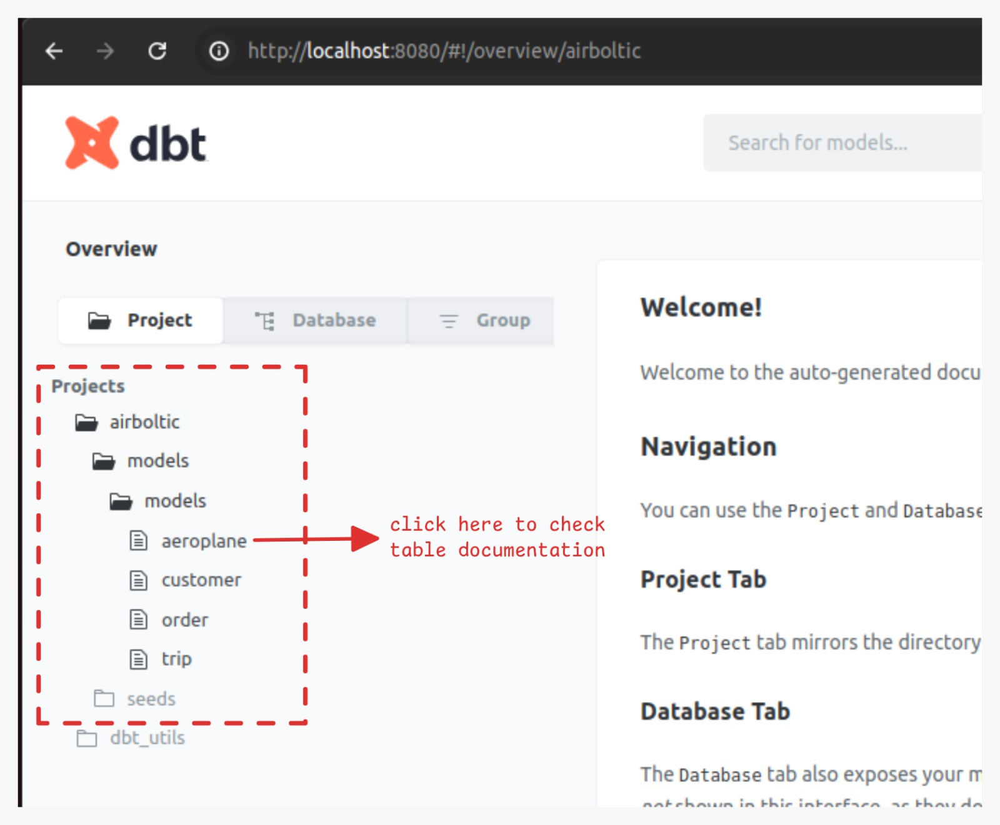

# Air Boltic
A data modeling project using DBT for an airline, focused on facilitating monitoring and self-service analysis.

## Source ERD
The company had a source ERD, shown below:



This ERD has some problems:
- Multiple joins are needed to answer simple business questions and to create KPIs (e.g., What is the seat occupancy per trip?);
- With multiple and complex joins, the query performance decreases;
- The ERD is complex when considering its use in data visualization platforms like Looker, Tableau, or Power BI. The purpose of these tools is to make analysts' lives easier with drag-and-drop functionality. However, when using the source ERD, analysts will need to prepare the data before using it.;
- There is no pattern in the columns names:
    - It is common for the name of a Primary Key (PK) to be 'id';
    - Another problem is the use of different names for the same concept, such as 'aeroplane' and 'airplane.' For example, the primary key of the 'aeroplane' table is named 'airplane_id';

> Due to these points above, the source ERD is not adequate for serving data to business departments, using it the departments will need more data modeling context to extract what they need. 
 
## Suggested ERD
A new ERD is proposed for this project, optimized for business departments, facilitating operations monitoring, KPIs construction and making it easier to answer business questions.

<!--  -->


The new ERD is drawn as a Star Schema model, with four tables:
- **Trip:** A table containing trip details, acting as a dimension in this model;
- **Aeroplane:** A table consolidating data from the source tables `aeroplane` and `aeroplane_model`, acting as a dimension in this model;
- **Customer:** A table consolidating data from `customer` and `customer_group`. This table provides additional details about customers, including some metrics, acting as a dimension in this model.
- **Order:** A table containing order details, metrics, and all IDs for the dimension tables, acting as the fact table in this model.

### Why a star schema model?
A star schema model is a common industry pratice, with different benefits:
- Simplified JOIN operation between fact table and dimensions:
    - Business departments can extract what they need in an easy way;
    - Without complex joins, query performance improves;
- It's simple to understand the table's relationships and hierarchies:
    - Simple to design, implement, and maintain;
    - Designed to data visualization tools and OLAP systems, making drag and drop analysis easier;
    - Scalable for increasing business complexity, allowing interaction with multiple fact tables when needed.

## Installation
Firstly, clone the repository and install dependencies:

```
git clone https://github.com/luccabrandao98/air-boltic.git
cd air-boltic
pip install -r requirements.txt
```

## Configuration
To run locally fill in `air-boltic-models/profiles.yml` the variables provided: 
- HOST;
- USER;
- PASSWORD;
- PORT;
- SCHEMA;

Then change to `air-boltic-models` directory and test run a model:
```
cd air-boltic-models
dbt seed
dbt run -m order
```
> **IMPORTANT**: without changing to air-boltic-models directory dbt commands will not run;

## Project details



- The source tables are stored as `seed` in the `airboltic_raw` schema using `src` prefix (e.g, `airboltic_raw.src_aeroplane`)
    - To create these tables: `dbt seed`
    - The file `src_aeroplane_model` is a output from the script: `aeroplane_model_transformation/aeroplane_model_to_csv.py`, used to convert the JSON provided to a csv file;
- The new ERD models are stored in the `airboltic_models` schema, without any prefix (e.g, `airboltic_models.aeroplane`)
    - To create these tables: `dbt run -m model_name`, replacing model_name

> All new models have a documentation and tests in .yml files, with the same name. To run these tests: `dbt test -m model_name` replacing model_name;

Also, check the documentation after run the models:
```
dbt docs generate
dbt docs serve
```
The second command will open a localhost tab:

